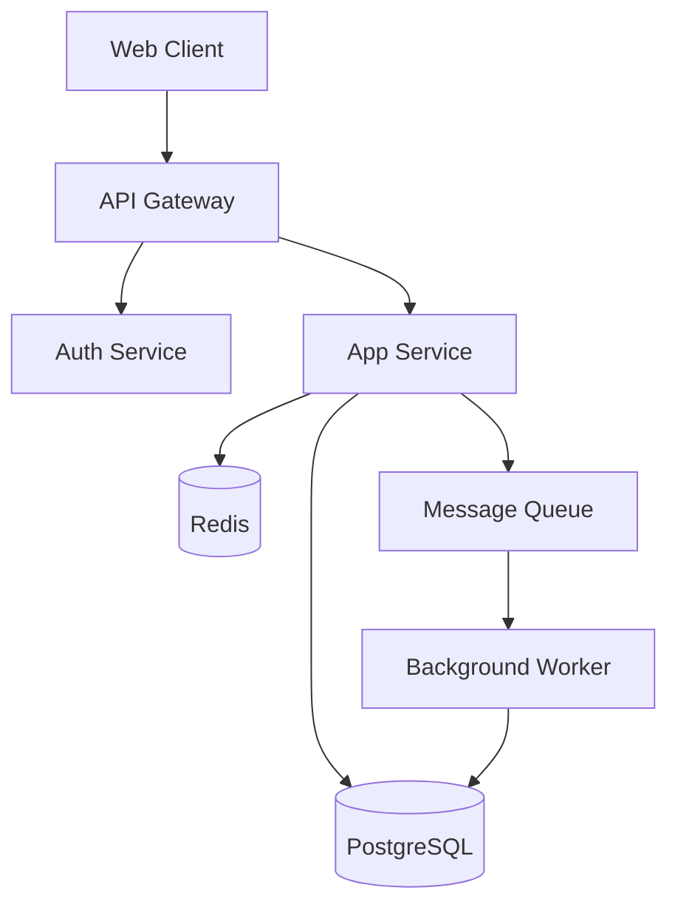

# System Architecture Expert

Helps you decide how the pieces of a system fit together — the layer between
individual component design and infrastructure deployment. Works for both
greenfield architecture and evolving existing systems.

## When to Use

- Deciding overall application structure (monolith, microservices, serverless, hybrid)
- Designing how frontend, backend, and data layers connect
- Choosing communication patterns between services (sync/async, REST/gRPC/events)
- Planning caching strategy across layers
- Drawing service boundaries in a growing system
- Evaluating whether to split, merge, or restructure parts of an existing system
- Cross-cutting concerns: auth architecture, error handling strategy, config management

## When NOT to Use

- **Choosing a data structure or algorithm** — use `dsa-expert`
- **Designing API contracts** — use `api-architect` (come here first if unsure which APIs you even need)
- **Database schema design** — use `database-expert` (come here first if unsure about your data layer strategy)
- **Docker/K8s/Terraform** — use `infrastructure-expert`
- **Understanding an existing codebase** — use `codebase-explainer`

## Process

### Step 1: Understand Goals and Constraints

Architecture is driven by what you're optimizing for. These trade-offs are
real and unavoidable — you can't have all of them. Before recommending
anything, clarify:

**Ask the user about:**

1. **What does success look like?** — What's the product or outcome? Who uses it? This shapes every downstream decision.
2. **What are the hard constraints?** — Team size, timeline, existing tech stack, budget, compliance requirements.
3. **What are you optimizing for?** — Development speed, operational simplicity, independent deployability, latency, throughput, cost efficiency. Pick at most 2-3; you can't optimize for everything.
4. **What's the expected scale?** — Users, requests/sec, data volume. Be specific — "a lot" isn't a constraint. Current numbers AND 12-month projections.
5. **What exists today?** — Greenfield or brownfield? If evolving, what's the current architecture and what pain points drove this conversation?

Present the constraint summary back to the user before proceeding. This is
the most important step — a good architecture for a 3-person startup looks
nothing like a good architecture for a 50-person org, even if the product
is identical.

### Step 2: Identify the Architectural Style

Based on the constraints, recommend an architectural style. The right answer
depends heavily on context, so always explain *why* a style fits the user's
specific situation rather than prescribing a universal answer.

#### Decision Framework

```
Is the team small (1-5 devs) AND the product early-stage?
  → Start with a modular monolith. Microservices add operational complexity
    that will slow you down more than the modularity helps.

Do different parts of the system have fundamentally different scaling needs?
  (e.g., video transcoding vs user auth)
  → Consider extracting those specific parts as services. Not everything
    needs to be a separate service — just the parts with different
    operational characteristics.

Do multiple teams need to deploy independently?
  → Microservices or well-defined service boundaries become necessary for
    organizational reasons, not just technical ones. Conway's Law is real.

Is the workload event-driven with variable load?
  (e.g., file processing, webhooks, scheduled jobs)
  → Serverless / function-as-a-service for those specific workloads.
    Don't force your entire system into serverless if it doesn't fit.

Are you evolving an existing monolith?
  → Strangler fig pattern: new features as services, gradually extract
    existing features. Don't attempt a big-bang rewrite.
```

#### Common Styles Reference

| Style | Best For | Watch Out For |
|-------|----------|---------------|
| **Modular monolith** | Small teams, early products, rapid iteration | Module boundaries can erode without discipline |
| **Microservices** | Large orgs, independent team deployments, heterogeneous scaling | Operational complexity, distributed debugging, data consistency |
| **Serverless** | Event-driven workloads, variable load, low-ops teams | Cold starts, vendor lock-in, hard to test locally |
| **Event-driven** | Decoupled producers/consumers, audit trails, eventual consistency OK | Debugging event chains, ordering guarantees, idempotency |
| **Monolith + async workers** | Web app with background processing (emails, reports, imports) | Queue management, retry logic, dead letter handling |
| **Backend-for-Frontend (BFF)** | Multiple clients (web, mobile, CLI) with different data needs | Proliferation of BFF services if not managed |

### Step 3: Design the Layer Structure

Once the architectural style is chosen, define how the layers connect.

#### Backend Layering

Most backend applications benefit from clear separation between:

```
Entrypoint (HTTP handler / CLI / event consumer)
  ↓
Service layer (business logic, orchestration)
  ↓
Repository / data access layer (database, external APIs, cache)
  ↓
Infrastructure (database driver, HTTP client, message broker)
```

This isn't about dogma — it's about keeping business logic testable without
needing a running database or HTTP server. The service layer should be the
thickest layer; if your handlers or repositories contain business logic,
the boundaries have leaked.

**Key decision: how do layers communicate?**
- Direct function calls (monolith) — simplest, start here
- In-process events/mediator — when you want loose coupling without network overhead
- HTTP/gRPC (between services) — when services are separately deployed
- Message queue (async) — when the caller doesn't need to wait for the result

#### Frontend Architecture

| Pattern | When to Use |
|---------|-------------|
| **Server-rendered (SSR/SSG)** | Content-heavy sites, SEO matters, simple interactivity |
| **Single Page App (SPA)** | Highly interactive apps, real-time updates, app-like UX |
| **Islands architecture** | Mostly static with isolated interactive components |
| **Micro-frontends** | Multiple teams owning different parts of the UI (last resort — adds significant complexity) |

**State management decision:**
- Local component state → for UI-only state (form inputs, toggles)
- Shared client state (Redux/Zustand/signals) → for state shared across components
- Server state (React Query/SWR/TanStack Query) → for data fetched from APIs — treat the server as the source of truth

#### Data Layer Strategy

| Pattern | When to Use |
|---------|-------------|
| **Single database, direct access** | Monolith, simple apps, one team |
| **Database per service** | Microservices (each service owns its data) |
| **CQRS (separate read/write models)** | Read and write patterns are fundamentally different (e.g., complex queries vs simple writes) |
| **Event sourcing** | Need full audit trail, temporal queries, or event-driven architecture fits naturally |
| **Read replicas** | Read-heavy workload, can tolerate slight staleness |
| **Polyglot persistence** | Different data types need different storage (relational + document + search) |

For most applications: start with a single database. Add read replicas or
caching when you have measured evidence of read bottlenecks. CQRS and event
sourcing solve real problems but add significant complexity — don't reach
for them preemptively.

### Step 4: Address Cross-Cutting Concerns

These concerns span all layers and need explicit architectural decisions.
Don't let them emerge accidentally.

**Authentication & Authorization**
- Where does auth happen? (API gateway, each service, middleware)
- Token format: JWT (stateless, good for distributed) vs session (simpler, revocable)
- Authorization model: RBAC, ABAC, or simple permission checks
- For microservices: auth at the gateway, pass identity downstream via headers

**Error Handling Strategy**
- Define error categories: client errors (4xx), transient errors (retry), permanent errors (alert)
- Where are errors caught vs propagated?
- Structured error responses across all services (consistent shape)
- For distributed systems: circuit breakers for calls between services

**Caching Architecture**
- Browser/CDN → static assets, public API responses
- Application-level (in-memory) → hot data, computed results, session data
- Distributed cache (Redis/Memcached) → shared across instances, larger dataset
- Database query cache → repeated expensive queries
- Rule of thumb: cache at the outermost layer that makes sense. Every cache layer adds invalidation complexity.

**Configuration & Secrets**
- Environment variables for deployment config
- Secret manager (Vault, AWS Secrets Manager) for credentials
- Feature flags for runtime behavior changes
- Don't bake config into code or container images

### Step 5: Validate and Document

Summarize the architecture as:

1. **Architecture Decision Record (ADR)** — for each major decision:
   - Context: what's the situation and constraints
   - Decision: what we chose
   - Consequences: what trade-offs we accepted
   - Alternatives considered: what we didn't choose and why

2. **Component diagram** — if helpful, a simple Mermaid diagram showing major components and their interactions:



3. **Handoff notes** — which existing skills should be engaged next:
   - `api-architect` for API contract design
   - `database-expert` for schema design
   - `infrastructure-expert` for deployment setup
   - `dsa-expert` for performance-critical component design

## Integration Patterns Reference

When services need to talk to each other, the pattern matters:

| Pattern | Use When | Trade-off |
|---------|----------|-----------|
| **Synchronous request/response** (HTTP/gRPC) | Caller needs the result immediately | Tight coupling, cascading failures |
| **Async messaging** (queue/topic) | Caller doesn't need immediate result | Eventual consistency, harder debugging |
| **Event notification** | "Something happened, react if you care" | Very loose coupling, can be hard to trace |
| **Event-carried state transfer** | Consumers need the data, not just the notification | Consumers have local copies, eventually consistent |
| **Saga (orchestration)** | Multi-step distributed transaction with compensating actions | Complex, needs explicit rollback logic |
| **Saga (choreography)** | Each service reacts to events and emits its own | Decentralized, harder to understand the full flow |

**Default to synchronous request/response until you have a reason not to.**
Async adds complexity. The reasons to go async: the work is slow, the
caller doesn't need the result, you need to decouple for reliability, or
you need to fan out to multiple consumers.

## Scaling Patterns Reference

| Strategy | When to Apply |
|----------|--------------|
| **Vertical scaling** | First option — bigger machine, no code changes |
| **Horizontal scaling** (stateless app servers) | App tier is the bottleneck, sessions stored externally |
| **Read replicas** | Database reads are the bottleneck |
| **Sharding** | Single database instance can't hold the data (last resort for RDBMS) |
| **CDN** | Static assets, geographically distributed users |
| **Connection pooling** | Too many connections to database |
| **Rate limiting** | Protect against abuse, shape traffic |
| **Backpressure** | Producers faster than consumers — slow the producer, don't drop messages |

**Start with vertical scaling.** It's boring and it works. Move to
horizontal scaling when you've measured a bottleneck that vertical can't
solve, or when you need redundancy for availability.

## Anti-patterns

| Anti-pattern | Why It Hurts | Instead |
|-------------|-------------|---------|
| Microservices for a small team | Operational overhead dwarfs benefits | Modular monolith with clear boundaries |
| Shared database between services | Tight coupling through data | Each service owns its data, sync via APIs/events |
| Distributed monolith | Microservices that must deploy together | If they deploy together, they should be one service |
| Big-bang rewrite | High risk, long timeline, demoralizing | Strangler fig — incrementally replace |
| Premature CQRS/event sourcing | Complexity without measured need | Start simple, add when pain is real and measured |
| Caching everything | Stale data bugs, invalidation complexity | Cache measured hot paths with clear TTL strategy |
| "Just add a message queue" | Queues don't fix architectural problems | Understand why things are slow first |
| Resume-driven architecture | Choosing tech to learn it, not because it fits | Choose boring technology that your team knows |

## Outputs

- Constraint summary with user's goals and trade-offs
- Architectural style recommendation with reasoning
- Layer structure (backend, frontend, data) with communication patterns
- Cross-cutting concern decisions (auth, errors, caching, config)
- ADR for each major decision
- Optional Mermaid diagram of component relationships
- Handoff to api-architect, database-expert, infrastructure-expert, dsa-expert as needed
