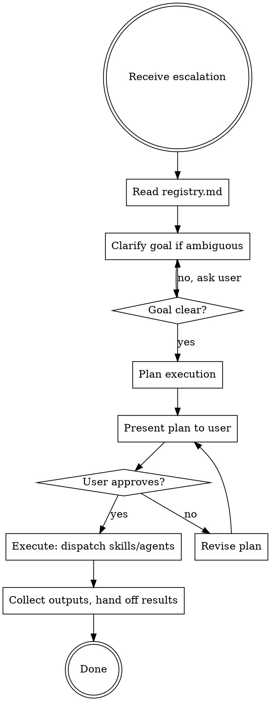

# Complex Orchestrator

The planning brain for high-complexity tasks. Called by simple-orchestrator; never invoked
directly by the user. Reads the full registry to understand skill contracts, then produces
and executes a coordinated plan.

## On Invocation

Before planning, read the agent bus if it exists:

```bash
cf-context --write   # project fingerprint
cf-status --write    # git topology
cf-note --read       # any findings from prior agents this session
```

This gives full situational awareness before touching anything.

## Inputs (from simple-orchestrator)

- User's goal (verbatim or summary)
- Which complexity axes scored HIGH
- Any known context (current branch, active worktrees, recent work)

## Process



## Reading the Registry

The registry is at `dev-suite/registry.md` relative to the claudefiles repo root.
Read it to understand:
- What each skill expects as **inputs**
- What each skill produces as **outputs**
- How skills **chain** (which skill's output feeds the next skill's input)
- What **tools** each skill requires

## Planning Rules

1. **Prefer sequential over parallel** when skills share state (e.g., git-expert must run before other skills that need a worktree path)
2. **Prefer parallel** when skills are independent (e.g., docs-agent + research-agent can run simultaneously)
3. **Set up git context first** — if any skill needs a worktree, invoke git-expert first and capture its output before proceeding
4. **Always present the plan** before executing. Include: which skills, in what order, why.
5. **Checkpoint after each skill** — verify output matches expected before feeding to the next skill

## Execution

- Use the `dispatching-parallel-agents` skill when launching multiple independent agents
- Use the `subagent-driven-development` skill when executing a sequential plan in the current session
- Capture outputs explicitly and pass them as inputs to downstream skills

## Output

At completion, summarise:
- What was done
- What each skill produced
- Any worktrees created (paths + branches)
- Any follow-up actions the user should take

## Anti-patterns

| Thought | Reality |
|---------|---------|
| "I'll figure out the plan as I go" | Read the registry first. Plan before acting. |
| "These skills can probably run in parallel" | Check for shared state. Parallel only when truly independent. |
| "The user's goal is clear enough" | If any ambiguity could cause rework, ask before executing. |
| "I'll skip the plan presentation to save time" | Never. User must approve before execution. |
