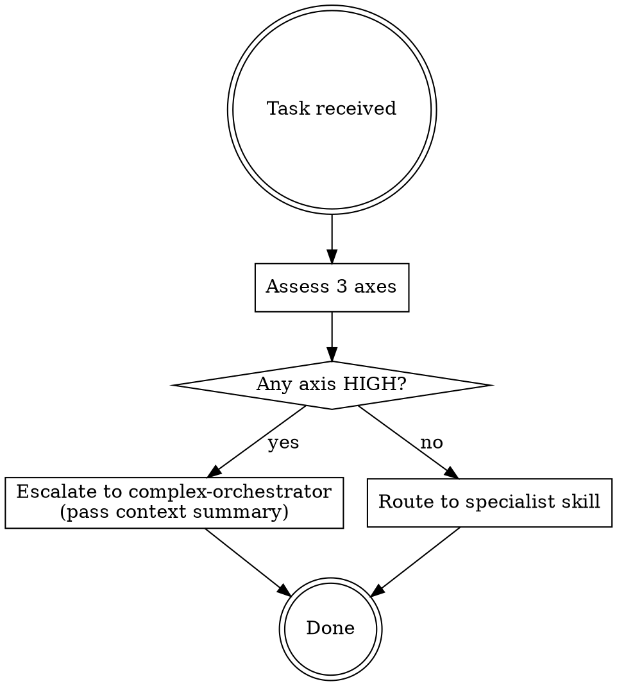

# Simple Orchestrator

Lightweight triage skill that runs on every task. Its only job is to decide: handle this
directly (route to a specialist), or escalate to the complex-orchestrator for full planning.

It reads only the skill list already in context (system-reminder frontmatter). No file reads.
No registry access. Fast.

## Complexity Assessment

Score the task on these three axes. Any axis scoring HIGH triggers escalation.

### 1. Scope
- **LOW:** Single file, single component, or a well-defined fix with a known location
- **HIGH:** Multiple components, cross-cutting concerns, unclear blast radius

### 2. Research / Context Needed
- **LOW:** Answer is known or derivable from the current codebase without investigation
- **HIGH:** Requires investigating unfamiliar libraries, understanding existing patterns first, or resolving ambiguity before acting

### 3. Agent Coordination
- **LOW:** One agent, one task, one directory
- **HIGH:** Needs parallel agents, worktrees, or sequential skill chaining

## On Invocation: Check the Bus

Before assessing complexity, check if `.claudefiles/` exists in the project root:

```bash
cf-read   # dumps full bus state if the bus exists
```

If the bus exists, its contents inform the routing decision — e.g. if `notes.md` shows
research-agent already investigated something, don't escalate for more research.
If the bus doesn't exist yet, proceed without it.

## Decision Flow



## Routing Guide

Use the skill descriptions already in context to route. Quick reference:

| Task type | Route to |
|-----------|----------|
| Git ops, worktrees, branching | `git-expert` |
| API design or review | `api-architect` |
| Library/framework docs lookup | `docs-agent` |
| General research, analysis, consensus | `research-agent` |
| Complex multi-skill task | `complex-orchestrator` |

## Context Summary (when escalating)

When handing off to complex-orchestrator, include:
- What the user asked for (verbatim or paraphrased)
- Which axis/axes scored HIGH and why
- Any relevant context already known (current branch, active worktrees, recent work)

## When NOT to escalate

Do not escalate for:
- Tasks you can answer conversationally without tool use
- Single-skill tasks even if they feel large (let the specialist handle scope)
- Tasks where the user has already provided a clear, bounded plan

## Anti-patterns

| Thought | Reality |
|---------|---------|
| "I'll just start, it seems simple" | Assess first. Always. |
| "The user asked for one thing so it must be LOW scope" | Scope is about blast radius, not number of requests |
| "I don't want to add overhead" | Triage takes seconds. Bad routing costs minutes. |
