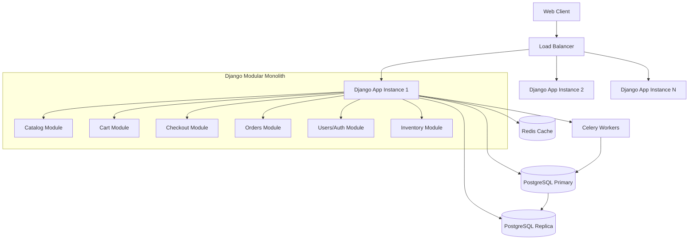
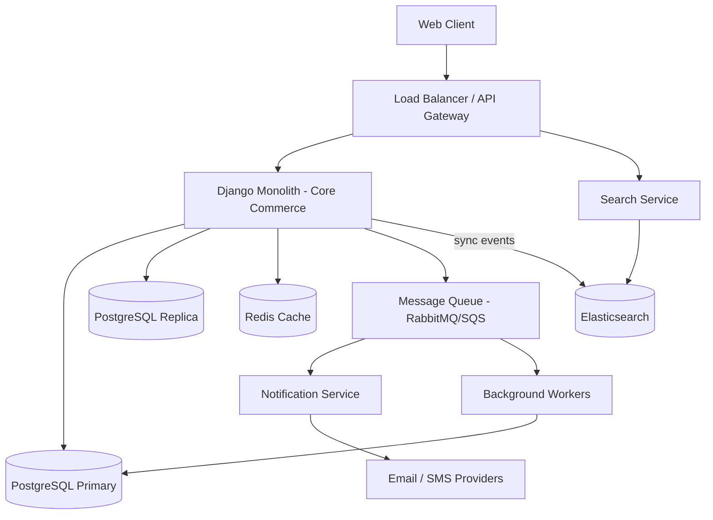

# System Architecture Analysis: Django Monolith to Microservices?

## Step 1: Goals and Constraints

Since I cannot ask questions interactively, I am stating my assumptions explicitly based on the context provided.

### Assumptions

1. **What does success look like?** -- An e-commerce platform that handles growing traffic without degraded response times, and a development workflow where 12 engineers can ship features without constant merge conflicts, coordinating deploys, or stepping on each other's database migrations. The users are online shoppers; the product includes catalog browsing, cart, checkout, payments, order management, and likely some admin/back-office tooling.

2. **What are the hard constraints?**
   - Team size: 12 developers (and presumably growing).
   - Existing stack: Django (Python), likely PostgreSQL as the database, possibly some Redis/Celery for background tasks. Assumed standard Django ORM usage.
   - Timeline: Not an emergency (the system works at 500 req/s, it's getting slow, not falling over). This gives time for an incremental approach.
   - Budget: Assumed moderate -- this is a real e-commerce business generating revenue, but not a FAANG-scale budget. Cost-conscious but willing to invest.
   - Compliance: Standard e-commerce (PCI-DSS for payment data is assumed, but likely handled by a payment processor like Stripe).

3. **What are you optimizing for?** (picking 2-3)
   - **Team autonomy / independent deployability** -- 12 devs stepping on each other is the primary organizational pain.
   - **Operational reliability under load** -- 500 req/s is a real workload but not extreme; the system should handle 2-3x growth.
   - **Development velocity** -- the team needs to ship features without coordinating every deploy.

4. **What's the expected scale?**
   - Current: ~500 req/s (moderate). Assuming a typical e-commerce traffic pattern with spikes during sales/promotions (likely 2-5x baseline).
   - 12-month projection: Assumed 1,000-1,500 req/s sustained, with spikes to 3,000-5,000 req/s during peak events.
   - Data volume: Assumed millions of products, tens of millions of orders. Not petabyte-scale.

5. **What exists today?**
   - A Django monolith. Assumed: single Django project, single database, most features tightly coupled through Django's ORM and app structure.
   - Pain points: slow under load, developer contention (merge conflicts, deployment coordination, migration conflicts).

### Constraint Summary

| Dimension | Value |
|-----------|-------|
| Team size | 12 devs, likely growing |
| Current load | ~500 req/s, degrading |
| Target load (12 months) | 1,000-1,500 req/s sustained, 3-5k spikes |
| Primary optimization | Team autonomy, reliability, dev velocity |
| Existing system | Django monolith, single database |
| Key pain | Performance under load + developer contention |
| Timeline for change | Incremental (not an emergency) |

---

## Step 2: Architectural Style Recommendation

### The Answer: No, Do Not Move to Microservices (Yet). Move to a Modular Monolith First, Then Selectively Extract.

Walking through the decision framework:

- **Is the team small (1-5 devs)?** No -- 12 devs. This rules out "just stay monolithic and don't worry about it."
- **Do different parts have fundamentally different scaling needs?** Likely yes. Catalog browsing (read-heavy, cacheable) is very different from checkout/payment (write-heavy, transactional). But we haven't measured this yet.
- **Do multiple teams need to deploy independently?** This is the real driver. With 12 devs, you likely have 2-4 sub-teams, and they are stepping on each other. Conway's Law applies.
- **Are you evolving an existing monolith?** Yes. This means: **strangler fig pattern**, not a big-bang rewrite.

### Recommended Path: Three Phases

**Phase 1 (Months 1-3): Modular Monolith + Performance Fixes**

Before extracting anything, enforce module boundaries *within* the existing Django project. This gives you 80% of the organizational benefit at 10% of the operational cost.

- Reorganize Django apps into well-defined bounded contexts (Catalog, Cart, Checkout/Payment, Orders, Users/Auth, Inventory, Search, Notifications).
- Enforce that apps communicate only through defined Python interfaces (service classes), not by importing each other's models directly.
- Fix the performance problems independently -- 500 req/s is well within what a properly optimized Django monolith can handle.

**Phase 2 (Months 3-6): Extract High-Value Services**

Once module boundaries are clean, extract 1-2 services where there is a clear operational or organizational reason:

- **Search** -- likely best served by a dedicated search service (Elasticsearch/OpenSearch) with its own API. Different scaling profile, different tech is appropriate.
- **Notifications** (email, SMS, push) -- naturally async, no reason for it to be in the request path.
- **Background processing** -- if not already using Celery, extract long-running tasks (report generation, bulk imports, image processing) into async workers.

**Phase 3 (Months 6-12): Evaluate Further Extraction**

Based on measured data from Phase 1-2, decide whether further extraction is warranted. Candidates:

- **Catalog/Product service** if it has fundamentally different scaling needs than order management.
- **Checkout/Payment** if regulatory isolation or independent scaling is needed.

Do NOT extract further just because "microservices are the right architecture." Each extraction adds operational cost. Only extract when the benefit (team autonomy, scaling, tech fit) clearly outweighs the cost (distributed debugging, network latency, data consistency).

### Why Not Jump Straight to Microservices?

| Concern | Why Microservices Are Premature |
|---------|-------------------------------|
| 500 req/s is slow | This is a performance problem, not an architecture problem. A well-optimized Django app on a single machine handles 2,000+ req/s. Profile first. |
| Devs stepping on each other | Module boundaries within the monolith solve 80% of this. Microservices solve the rest but add distributed systems complexity. |
| Operational cost | 12 devs maintaining 8-15 microservices means everyone is doing ops instead of features. You need at least a dedicated platform/SRE team. |
| Data consistency | E-commerce requires strong consistency for inventory/checkout. Distributed transactions across microservices are painful. |
| Big-bang risk | Rewriting a running e-commerce platform into microservices while it's serving customers is extremely high risk. |

---

## Step 3: Layer Structure

### Backend Layering (Within the Modular Monolith)

```
HTTP Request
  |
  v
Django Views / DRF ViewSets (thin -- validation, serialization only)
  |
  v
Service Layer (business logic, orchestration between modules)
  |
  v
Repository / Data Access (Django ORM queries, encapsulated per module)
  |
  v
Infrastructure (PostgreSQL, Redis, Celery, external APIs)
```

**Key rules:**
- Views do NOT contain business logic. They validate input, call a service, serialize output.
- Services do NOT import models from other modules. They call that module's service interface.
- Each Django app/module owns its own models. No cross-module ORM joins.

### Communication Patterns

| Communication | Pattern | Reason |
|--------------|---------|--------|
| Between modules (same process) | Direct function calls via service interfaces | Simple, fast, transactional |
| To search service (Phase 2) | HTTP (sync) for queries | Search needs fast responses |
| To notification service (Phase 2) | Message queue (async) | Caller doesn't need to wait |
| To background workers | Celery / message queue (async) | Long-running tasks |

### Frontend Architecture

Assumed: either server-rendered Django templates or a SPA (React/Vue). No change recommended here unless there's a specific pain point. If server-rendered, consider:

- CDN for static assets and cacheable pages (product listings).
- If migrating to a SPA, consider a BFF layer to aggregate backend calls -- but only if you've extracted services that the frontend would otherwise need to call individually.

### Data Layer Strategy

**Phase 1: Single database (PostgreSQL) with read replicas.**

- Add a read replica for read-heavy traffic (catalog browsing, search, reporting).
- Route writes to primary, reads to replica. Django supports database routing natively.
- This alone may solve the 500 req/s performance problem.

**Phase 2: Dedicated data stores for extracted services.**

- Search: Elasticsearch/OpenSearch (synced from primary DB via events or CDC).
- Cache: Redis for session data, frequently accessed catalog data, cart state.

**Do NOT split the main database prematurely.** A single PostgreSQL instance can handle millions of rows and thousands of req/s. Splitting the database across services creates distributed transaction problems that are especially painful for e-commerce (inventory consistency, order integrity).

---

## Step 4: Cross-Cutting Concerns

### Authentication & Authorization

- **Keep auth in Django middleware.** Django's auth system is mature and well-understood.
- Session-based auth for web users (simpler, revocable). JWT only if you have a mobile app or SPA that needs stateless auth.
- When services are extracted (Phase 2+), use an API gateway or shared middleware that validates auth tokens and passes identity downstream via headers.
- Authorization: Django's permission system (RBAC) is sufficient for most e-commerce use cases.

### Error Handling Strategy

- Standardize error response format across all endpoints (consistent JSON shape with error code, message, and optional details).
- Client errors (4xx): return immediately with useful error messages.
- Transient errors (database timeouts, external API failures): implement retry with exponential backoff at the service layer.
- For extracted services (Phase 2+): add circuit breakers (e.g., `pybreaker`) for calls between services.
- Centralized error tracking (Sentry or equivalent).

### Caching Architecture

This is likely the single most impactful performance improvement.

```
Browser cache (Cache-Control headers)
  |
  v
CDN (CloudFront / Cloudflare) -- static assets, public product pages
  |
  v
Application cache (Redis)
  - Product catalog data (TTL: 5-15 min)
  - Category trees (TTL: 1 hour)
  - User session data
  - Cart state (if using Redis-backed sessions)
  |
  v
Database query cache (pg_stat_statements to identify hot queries)
  - Read replicas for read-heavy endpoints
```

**Specific recommendations:**
- Cache product listings aggressively (they change infrequently).
- Do NOT cache checkout/payment flows (consistency is critical).
- Use Django's cache framework with Redis backend.
- Implement cache invalidation on write (not TTL-only) for inventory counts.

### Configuration & Secrets

- Environment variables for all deployment configuration (via `django-environ` or `python-decouple`).
- Secret manager for database credentials, API keys, payment processor secrets.
- Feature flags (Django Waffle or LaunchDarkly) for gradual rollouts -- especially important with 12 devs shipping features.
- Separate settings files for dev/staging/production is fine but all secrets come from environment, never from code.

---

## Step 5: Validate and Document

### Architecture Decision Records

#### ADR-001: Modular Monolith Before Microservices

- **Context:** Django monolith serving ~500 req/s is getting slow. 12 developers experience contention. Team is considering microservices.
- **Decision:** Restructure the existing Django application into a modular monolith with enforced module boundaries before extracting any services.
- **Consequences:**
  - Lower operational complexity than microservices (no distributed systems overhead).
  - Requires discipline to maintain module boundaries (code reviews, linting rules, architectural tests).
  - May still need selective service extraction later (Phase 2-3).
  - Faster to implement than a microservices migration (weeks, not months).
- **Alternatives considered:**
  - *Full microservices migration:* Rejected. Too high risk, too high operational cost for a 12-person team without dedicated platform engineers. The organizational pain doesn't yet justify distributed systems complexity.
  - *Do nothing:* Rejected. Performance and developer contention are real and growing problems.

#### ADR-002: Read Replicas and Caching Before Service Extraction

- **Context:** System is slow under load at 500 req/s.
- **Decision:** Add PostgreSQL read replicas and Redis caching before any architectural changes. Profile the application first to identify actual bottlenecks.
- **Consequences:**
  - Addresses the immediate performance problem with minimal architectural change.
  - Requires setting up Django database routing and cache invalidation logic.
  - May reveal that the performance problem is solvable without any service extraction.
- **Alternatives considered:**
  - *Extract hot services:* Rejected as premature. We haven't measured where the bottleneck is yet. It could be unindexed queries, N+1 ORM issues, or missing caching -- all fixable in the monolith.
  - *Vertical scaling:* Should also be evaluated. If the server is undersized, a bigger machine is the cheapest fix.

#### ADR-003: Strangler Fig for Service Extraction

- **Context:** When services are extracted (Phase 2+), how should we approach the migration?
- **Decision:** Use the strangler fig pattern. New functionality is built as services. Existing functionality is extracted incrementally, starting with the least coupled modules (search, notifications).
- **Consequences:**
  - Lower risk than a big-bang rewrite. The monolith continues to work throughout.
  - Requires maintaining both the monolith and new services during the transition period (increased operational scope).
  - Naturally prioritizes extraction by value (extract what hurts most first).
- **Alternatives considered:**
  - *Big-bang rewrite:* Rejected. High risk, long timeline, historically has a very high failure rate for running production systems.
  - *Never extract:* Possible. If the modular monolith solves the pain, there may be no need to extract services at all.

### Component Diagram

#### Phase 1: Modular Monolith



#### Phase 2: Selective Extraction



### Immediate Action Items (Priority Order)

1. **Profile the application.** Before any architectural change, measure where time is spent. Use Django Debug Toolbar, `django-silk`, or APM tooling (Datadog, New Relic) to identify the top 10 slowest endpoints and queries.
2. **Fix the obvious performance issues.** In nearly every slow Django app, there are unindexed queries, N+1 ORM problems, and missing caching. Fix these first -- it may solve the 500 req/s problem entirely.
3. **Add caching.** Redis-backed caching for product catalog, category trees, and other read-heavy data.
4. **Add a read replica.** Route read-heavy traffic (product browsing, search) to the replica.
5. **Enforce module boundaries.** Restructure Django apps, define service interfaces, add architectural tests (e.g., import linting) to prevent cross-module coupling.
6. **Only then evaluate extraction.** With clean module boundaries and performance data, you'll know exactly which services (if any) benefit from extraction.

### Handoff Notes

The following specialized skills should be engaged for subsequent work:

- **`database-expert`** -- Profile the PostgreSQL database, identify slow queries, design indexes, plan read replica routing, and evaluate connection pooling (PgBouncer).
- **`dsa-expert`** -- If profiling reveals performance-critical algorithms (e.g., search ranking, inventory allocation, pricing calculations), optimize those specific components.
- **`api-architect`** -- When extracting services in Phase 2, design the API contracts between the monolith and extracted services (search API, notification API).
- **`infrastructure-expert`** -- Set up load balancing, read replicas, Redis cluster, and (in Phase 2) container orchestration for extracted services.
