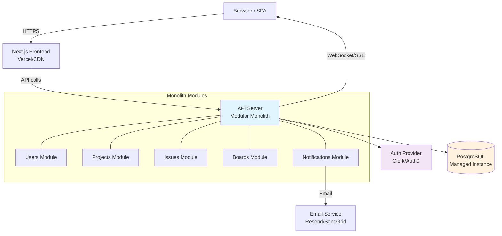

# Architecture Recommendation: SaaS Project Management Tool (Simplified Jira)

## Step 1: Goals and Constraints

Since this is a non-interactive session, the following assumptions are stated explicitly based on the context provided.

### Assumptions

- **Product**: A simplified Jira -- issue tracking, project boards (Kanban/Scrum), user assignments, status workflows, basic reporting. Not aiming for Jira's full feature set; targeting small-to-medium teams as end users.
- **Team**: 2 developers (you and one other). No dedicated ops, no dedicated designer.
- **Timeline**: MVP in 3 months. This is aggressive and rules out anything with high operational overhead.
- **Budget**: Assumed to be bootstrapped or early-stage -- cost efficiency matters. No large infrastructure spend.
- **Existing system**: Greenfield. No legacy code to work around.
- **Scale (current)**: Pre-launch, so effectively 0 users. MVP will target early adopters -- likely under 100 users, under 1,000 projects, under 10,000 issues.
- **Scale (12-month projection)**: Assuming moderate traction, perhaps 1,000-5,000 users, tens of thousands of issues. Nowhere near requiring distributed systems engineering.
- **Compliance**: No specific compliance requirements assumed (no HIPAA, SOC2, etc. for MVP).

### Constraint Summary

| Dimension | Value |
|-----------|-------|
| Team size | 2 developers |
| Timeline | 3 months to MVP |
| Stage | Greenfield, pre-launch |
| Budget | Low (startup/bootstrapped) |
| Optimizing for | **Development speed** and **operational simplicity** |
| Explicitly NOT optimizing for | Independent deployability, extreme scalability, microservice boundaries |
| Expected scale (now) | <100 users |
| Expected scale (12 months) | 1,000-5,000 users |

**The two optimization priorities -- development speed and operational simplicity -- drive every decision below.** With 2 devs and 3 months, any architecture that adds operational burden (multiple services, message brokers, container orchestration) is time stolen from building the product.

---

## Step 2: Architectural Style

### Recommendation: Modular Monolith

**Why this fits:**

- **Team is small (2 devs) AND the product is early-stage** -- this is the textbook case for a modular monolith. Microservices would add operational complexity (deployment pipelines per service, inter-service communication, distributed tracing, separate databases) that will slow you down far more than the modularity helps.
- **No fundamentally different scaling needs yet** -- issue tracking, boards, user management, and notifications all have similar scaling characteristics at this stage. There is no "video transcoding vs. auth" divergence that would justify service extraction.
- **Single deployment unit** -- one thing to build, test, deploy, and debug. With 2 devs, you cannot afford to be troubleshooting network calls between services.
- **Modular** is the key word -- this is NOT "big ball of mud." You structure the code into well-defined modules (projects, issues, users, notifications) with clear interfaces between them. If you ever need to extract a service later, the module boundaries make that straightforward.

**Why NOT microservices:**
Microservices for a 2-person team building an MVP is a well-documented anti-pattern. The operational overhead (service discovery, API gateways, distributed logging, multiple CI/CD pipelines, network failure handling) would consume a significant portion of your 3-month timeline without delivering user value.

**Why NOT serverless:**
Serverless (Lambda/Cloud Functions) could work for some workloads, but for a full CRUD application with real-time board updates, the developer experience friction (local testing, cold starts, connection pooling issues with databases) outweighs the benefits at this stage. Consider serverless later for specific workloads like PDF report generation or email sending.

### Recommended Tech Stack

Given the constraints (2 devs, speed, simplicity), pick technologies your team already knows. Below is a solid default stack, but swap anything your team has more experience with:

| Layer | Recommendation | Rationale |
|-------|---------------|-----------|
| **Backend** | Node.js (TypeScript) or Python (FastAPI/Django) or Go | Pick whatever your team is fastest in. TypeScript has the advantage of shared language with frontend. |
| **Frontend** | Next.js (React) or SvelteKit | Next.js gives you SSR for landing pages + SPA for the app. Large ecosystem. SvelteKit if your team prefers it. |
| **Database** | PostgreSQL | Battle-tested relational DB. Perfect for structured data like projects, issues, users, and their relationships. |
| **ORM/Query** | Prisma (if TS), SQLAlchemy (if Python), or raw SQL | Type-safe queries speed up development and reduce bugs. |
| **Auth** | Hosted auth provider (Clerk, Auth0, Supabase Auth) | Do not build auth from scratch. A hosted provider saves weeks and is more secure. |
| **Hosting** | Railway, Render, Fly.io, or Vercel + managed DB | PaaS removes ops burden. You push code, it deploys. No Kubernetes, no Docker orchestration. |
| **Real-time** (for boards) | WebSockets (Socket.io) or Server-Sent Events | SSE is simpler if you only need server-to-client updates. WebSockets if you need bidirectional. |

**"Choose boring technology."** Your competitive advantage is the product, not the stack. Every hour spent configuring infrastructure is an hour not spent building features users care about.

---

## Step 3: Layer Structure

### Backend Layering

```
src/
  modules/
    users/
      users.controller.ts       -- HTTP handlers (thin)
      users.service.ts           -- Business logic (thick)
      users.repository.ts        -- Data access
      users.types.ts             -- Types/interfaces
    projects/
      projects.controller.ts
      projects.service.ts
      projects.repository.ts
      projects.types.ts
    issues/
      issues.controller.ts
      issues.service.ts
      issues.repository.ts
      issues.types.ts
    boards/
      boards.controller.ts
      boards.service.ts
      boards.repository.ts
      boards.types.ts
    notifications/
      notifications.service.ts
      notifications.repository.ts
      notifications.types.ts
  shared/
    middleware/                   -- Auth, error handling, logging
    database/                    -- DB connection, migrations
    utils/                       -- Shared helpers
  app.ts                         -- Application setup
  server.ts                      -- Entrypoint
```

**Key principles:**

- **Controllers are thin.** They parse the request, call the service, and format the response. No business logic.
- **Services are thick.** All business logic lives here. "Can this user move this issue to Done?" is a service-layer question.
- **Repositories abstract data access.** The service layer never writes SQL directly. This makes testing easy (mock the repository) and makes future database changes possible.
- **Modules don't import each other's repositories.** If the `issues` module needs user data, it calls `users.service`, not `users.repository`. This enforces boundaries.

**Communication between layers: direct function calls.** This is a monolith -- no HTTP calls, no message queues between modules. Just function calls. This is the simplest and fastest option.

### Frontend Architecture

**Recommendation: Single Page App (SPA) for the application, with server-rendered landing/marketing pages.**

A project management tool is a highly interactive application -- drag-and-drop boards, real-time updates, complex filtering. This is SPA territory.

**State management approach:**
- **Server state (TanStack Query / SWR):** All data fetched from the API. This is the majority of your state. TanStack Query handles caching, background refetching, optimistic updates, and loading/error states out of the box.
- **Local component state (useState/signals):** UI-only state like "is this dropdown open," "what's the current drag target."
- **Minimal shared client state (Zustand or Context):** Only for truly global client-side state like current user, theme preference, sidebar collapsed state. Resist the urge to put server data here.

**Key frontend modules:**
- **Board view** -- Kanban columns with drag-and-drop (use a library like dnd-kit or @hello-pangea/dnd)
- **Issue detail** -- Side panel or full page for viewing/editing an issue
- **Project settings** -- Workflows, members, labels
- **Navigation** -- Project switcher, search

### Data Layer Strategy

**Recommendation: Single PostgreSQL database, direct access from the monolith.**

This is the correct starting point for your scale and team size. PostgreSQL handles relational data (users, projects, issues, comments, labels, assignments) extremely well.

**Key data entities and their relationships:**

```
Users ──┬── belongs to ──> Organizations (tenancy)
        └── assigned to ──> Issues

Projects ── belongs to ──> Organizations
         └── contains ──> Issues

Issues ── belongs to ──> Projects
       ├── has many ──> Comments
       ├── has many ──> Labels (many-to-many)
       ├── has ──> Status (from workflow)
       └── has ──> Assignee (User)

Workflows ── belongs to ──> Projects
          └── defines ──> Statuses + transitions
```

**Multi-tenancy approach:** Shared database with a `organization_id` column on all tenant-scoped tables. Row-level filtering in the repository layer. This is the simplest approach and works well up to thousands of tenants. Add PostgreSQL Row Level Security (RLS) policies for defense-in-depth.

**Do NOT add at this stage:**
- Read replicas (you won't have read bottlenecks with <5,000 users)
- CQRS (your read and write patterns are not divergent enough)
- Event sourcing (tempting for "issue history" but a simple `issue_events` audit table is far simpler)
- Redis cache (PostgreSQL with proper indexing will be fast enough; add caching only when you measure a bottleneck)

---

## Step 4: Cross-Cutting Concerns

### Authentication and Authorization

- **Auth provider:** Use a hosted service (Clerk, Auth0, or Supabase Auth). This handles signup, login, password reset, MFA, OAuth (Google/GitHub login), and email verification. Building this yourself would consume 2-4 weeks of your 3-month timeline.
- **Token format:** JWT issued by the auth provider, validated in middleware on every request.
- **Authorization model:** Simple RBAC (Role-Based Access Control) with roles scoped to organizations:
  - `owner` -- full access, billing, can delete org
  - `admin` -- manage members, project settings
  - `member` -- create/edit issues, comment
- **Implementation:** A single auth middleware that extracts the user from the JWT, attaches it to the request context, and verifies org membership. Permission checks happen in the service layer.

### Error Handling Strategy

- **Consistent error response shape** across all endpoints:
  ```json
  {
    "error": {
      "code": "ISSUE_NOT_FOUND",
      "message": "Issue PM-123 does not exist",
      "status": 404
    }
  }
  ```
- **Custom error classes** in the service layer (e.g., `NotFoundError`, `ForbiddenError`, `ValidationError`) that the controller/middleware maps to HTTP status codes.
- **Global error handler** middleware that catches unhandled errors, logs the stack trace, and returns a generic 500 to the client (never leak internal details).
- **Input validation** at the controller layer using a schema validation library (Zod, Joi, or Pydantic). Reject bad input before it reaches the service layer.

### Caching Architecture

**For MVP: almost no caching layer needed.**

- **Browser caching:** Let TanStack Query / SWR handle client-side caching with `staleTime` and background refetching. This alone eliminates most redundant API calls.
- **CDN:** Put static frontend assets (JS, CSS, images) behind a CDN. Most PaaS providers (Vercel, Netlify) do this automatically.
- **Database:** Rely on PostgreSQL's built-in query cache and proper indexing. Add indexes on foreign keys and commonly filtered columns (`organization_id`, `project_id`, `assignee_id`, `status`).
- **Do NOT add Redis yet.** You don't have a measured bottleneck. Adding Redis means another service to manage, another failure point, and cache invalidation complexity. Add it when you have evidence you need it.

### Configuration and Secrets

- **Environment variables** for all configuration (database URL, auth provider keys, API keys). Never hardcode.
- **`.env` file** for local development (gitignored).
- **PaaS environment config** for production (Railway/Render/Fly all support this natively).
- **Feature flags:** Start with a simple `features` table in the database or a config object. Don't bring in a feature flag service (LaunchDarkly, etc.) until you need percentage rollouts or A/B testing.

### Logging and Observability

- **Structured JSON logging** (use pino for Node.js, structlog for Python). Include `requestId`, `userId`, `organizationId` in every log line.
- **Request logging middleware** that logs method, path, status code, and duration for every request.
- **Error alerting:** Use a free tier of Sentry or Betterstack for error tracking. This is non-negotiable -- you need to know when things break in production.
- **Do NOT set up distributed tracing, custom metrics dashboards, or APM tools for MVP.** Structured logs + error tracking is sufficient.

---

## Step 5: Validate and Document

### Architecture Decision Records

#### ADR 1: Modular Monolith over Microservices

- **Context:** 2-person team building an MVP in 3 months. Need maximum development velocity and minimal operational overhead.
- **Decision:** Build as a modular monolith with clear module boundaries (users, projects, issues, boards, notifications).
- **Consequences:** Single deployment unit simplifies ops but means both devs work in the same codebase (acceptable for 2 people). Module boundaries must be enforced by convention/linting since there's no network boundary.
- **Alternatives considered:** Microservices (rejected: operational overhead would consume too much of the timeline), Serverless (rejected: poor fit for a stateful CRUD app, local development friction).

#### ADR 2: PostgreSQL as the Single Database

- **Context:** Need to store structured, relational data (users, orgs, projects, issues, comments, labels, assignments) with complex queries (filtering, sorting, aggregation).
- **Decision:** Single PostgreSQL instance. Shared-database multi-tenancy with `organization_id` filtering.
- **Consequences:** Simple to operate and reason about. May need read replicas if read traffic becomes a bottleneck at scale (unlikely within 12 months). No polyglot persistence complexity.
- **Alternatives considered:** MongoDB (rejected: data is highly relational, Mongo would require denormalization and lose referential integrity), separate DB per tenant (rejected: operational overhead of managing hundreds of databases is not justified at this scale).

#### ADR 3: Hosted Auth Provider over Custom Auth

- **Context:** Auth is critical for a SaaS product but is undifferentiated work. Building secure auth (password hashing, token management, MFA, OAuth, email verification, password reset) from scratch would take 2-4 weeks.
- **Decision:** Use a hosted auth provider (Clerk, Auth0, or Supabase Auth).
- **Consequences:** Monthly cost (~$0-25/month at MVP scale on free/starter tiers). Vendor dependency. Faster time-to-market and more secure than custom implementation.
- **Alternatives considered:** Custom auth (rejected: time cost too high for MVP timeline), Supabase Auth specifically if using Supabase for database (good synergy but locks into Supabase ecosystem).

#### ADR 4: PaaS Hosting over Containers/VMs

- **Context:** 2 developers with no dedicated ops capacity. Need to deploy and iterate quickly without managing infrastructure.
- **Decision:** Deploy on a PaaS (Railway, Render, or Fly.io) with a managed PostgreSQL instance.
- **Consequences:** Higher per-unit cost than raw VMs but eliminates ops burden entirely. Push-to-deploy workflow. May need to migrate to containers if the platform doesn't meet specific needs later.
- **Alternatives considered:** AWS/GCP with containers (rejected: requires Dockerfile, container registry, orchestration -- unnecessary complexity), Self-hosted VMs (rejected: requires manual server management, security patching, monitoring setup).

#### ADR 5: SPA with Server-State Management

- **Context:** Project management tools require highly interactive UIs (drag-and-drop boards, real-time updates, complex filtering).
- **Decision:** React SPA (via Next.js) with TanStack Query for server state and minimal client-side state.
- **Consequences:** Good interactivity and developer experience. SEO is not critical for an authenticated app (landing pages can be server-rendered by Next.js). Bundle size needs monitoring.
- **Alternatives considered:** Full server-rendered app with HTMX (rejected: drag-and-drop and real-time updates would fight the server-rendered model), Mobile-first with React Native (rejected: web MVP first, mobile later).

### Component Diagram



### What to Build First (MVP Scope Suggestion)

Given 3 months with 2 developers, here is a suggested priority order:

**Month 1: Foundation**
- Auth integration (signup, login, org creation)
- Project CRUD
- Issue CRUD (create, edit, assign, change status)
- Basic list view of issues with filtering

**Month 2: Core Experience**
- Kanban board view with drag-and-drop
- Comments on issues
- Labels and basic workflow customization
- Search across issues

**Month 3: Polish and Launch**
- Email notifications (assigned to you, mentioned, status changes)
- Basic reporting (issues created/closed over time)
- Onboarding flow
- Bug fixes, performance, edge cases
- Landing page

### Handoff Notes

Once this architecture is established, engage the following skills for deeper design:

- **`api-architect`** -- Design the REST API contracts for the issue, project, and board endpoints. Define request/response shapes, pagination strategy, and error format.
- **`database-expert`** -- Design the PostgreSQL schema: tables, indexes, constraints, multi-tenancy filtering, and the migration strategy.
- **`infrastructure-expert`** -- Set up the PaaS deployment, CI/CD pipeline (GitHub Actions), environment management (staging vs production), and database backup strategy.
- **`dsa-expert`** -- If board rendering or issue filtering becomes a performance concern, consult for efficient data structures (e.g., ordered lists for board column positioning).
