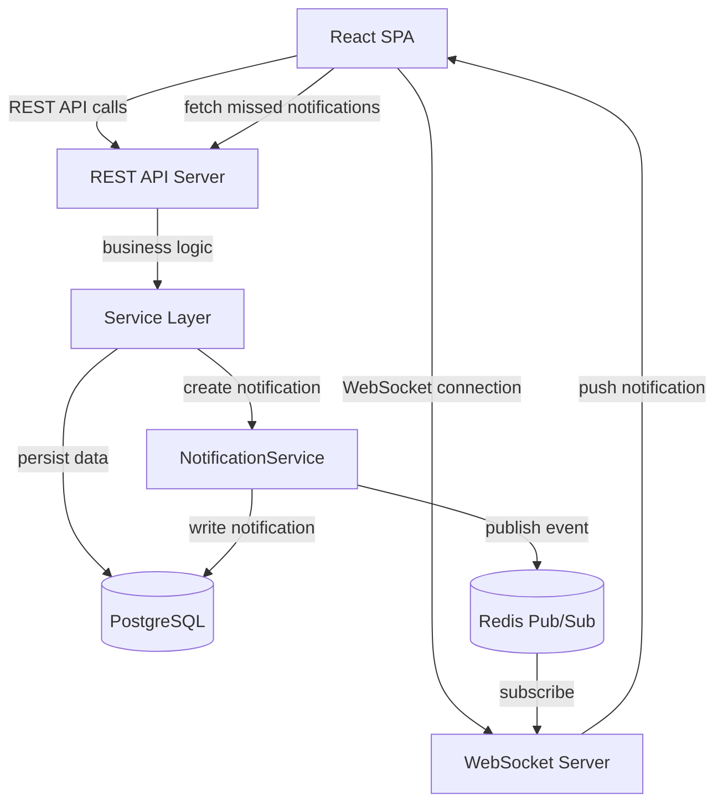

# Real-Time Notifications Architecture

## Step 1: Goals and Constraints

Since this is a non-interactive session, I am stating my assumptions explicitly based on the information provided.

### Assumptions

1. **What does success look like?** Users see real-time, in-app notifications when relevant events occur (task comments, assignments, status changes). The goal is a responsive, modern UX where users do not need to refresh to see updates. The app is a task/project management tool used by teams.

2. **What are the hard constraints?**
   - **Existing stack:** REST API backend (assumed Node.js or similar) + React SPA frontend. These cannot be replaced wholesale.
   - **Team size:** Assumed small-to-medium (3-10 developers). This means operational simplicity matters.
   - **Timeline:** Feature addition to an existing product, not a greenfield build. The solution must integrate with the current codebase.
   - **Budget:** No indication of unlimited budget; prefer solutions that do not require expensive managed services or a dedicated infrastructure team.

3. **What are we optimizing for?**
   - **Development speed** -- this is a feature addition, not a rewrite.
   - **Operational simplicity** -- the team already runs a REST API; adding a complex event-driven backbone would be disproportionate.
   - **User experience** -- notifications must feel instant (sub-second latency for in-app delivery).

4. **What is the expected scale?**
   - Assumed: hundreds to low thousands of concurrent users (typical SaaS task management tool).
   - Notification volume: moderate. Each user action (comment, assign) produces a small number of notifications (1-10 recipients per event).
   - 12-month projection: 10x current, so the design should handle tens of thousands of concurrent connections without architectural change.

5. **What exists today?**
   - REST API backend serving a React SPA.
   - No existing real-time infrastructure (no WebSocket server, no message broker).
   - Pain point: users must refresh to see updates, leading to stale data and poor collaboration UX.

### Constraint Summary

| Dimension | Value |
|-----------|-------|
| Product | Task/project management SaaS |
| Existing stack | REST API + React SPA |
| Team size | Small-to-medium (3-10) |
| Optimizing for | Dev speed, operational simplicity, UX responsiveness |
| Scale (now) | Hundreds of concurrent users |
| Scale (12 mo) | Low tens of thousands of concurrent connections |
| Hard constraints | Must integrate with existing REST API; no full rewrite |

---

## Step 2: Architectural Style

### Recommendation: Monolith + WebSocket Sidecar (with optional async workers)

The existing system is a monolith (single REST API). Given the team size and the nature of the feature (real-time push to clients), the right move is **not** to introduce microservices or a full event-driven backbone. Instead:

- **Keep the monolith.** The REST API continues to handle all business logic, authentication, and data persistence.
- **Add a WebSocket layer** as a lightweight sidecar or integrated module within the same backend process. This layer's only job is to hold client connections and push notifications.
- **Use an in-process or lightweight pub/sub mechanism** (e.g., Redis Pub/Sub) to bridge the REST request path to the WebSocket push path.

### Why This Style Fits

| Factor | Reasoning |
|--------|-----------|
| Small team | Adding a message broker, separate notification service, and event schema registry would be over-engineering. Redis Pub/Sub is operationally trivial. |
| Existing REST API | Business logic stays where it is. No need to refactor request handlers into event producers. |
| Scale target | A single Node.js process can hold ~50,000 concurrent WebSocket connections. Redis Pub/Sub handles millions of messages/sec. This covers the 12-month target with headroom. |
| Dev speed | WebSocket libraries (e.g., `ws`, Socket.IO) integrate directly into existing Node/Express apps. Minimal new infrastructure. |

### Why NOT Other Approaches

| Alternative | Why Not |
|-------------|---------|
| **Server-Sent Events (SSE)** | Viable, but unidirectional only. WebSockets allow future bidirectional communication (typing indicators, presence, acknowledgments). The complexity difference is small. |
| **Polling / Long-polling** | Wastes resources, adds latency, does not feel "real-time." |
| **Full event-driven architecture (Kafka, RabbitMQ)** | Massive operational overhead for a notification feature. Warranted if the entire system needs event sourcing -- it does not. |
| **Third-party push service (Pusher, Ably)** | Viable shortcut if the team wants zero infrastructure. Trade-off: vendor lock-in, per-message cost at scale, less control. Worth considering if the team is very small (<3 devs) or timeline is very tight. |
| **Microservice for notifications** | Adds deployment complexity, inter-service auth, network hops. Not justified at this scale/team size. |

---

## Step 3: Layer Structure

### High-Level Data Flow

```
User Action (e.g., comments on task)
  |
  v
REST API Handler (validates, persists comment to DB)
  |
  v
Notification Producer (determines who should be notified, writes notification record to DB)
  |
  v
Redis Pub/Sub (publishes notification event to a channel)
  |
  v
WebSocket Server (subscribed to Redis, pushes to connected clients)
  |
  v
React Client (receives notification via WebSocket, updates UI)
```

### Backend Layering

```
Entrypoints
  ├── REST Handlers (Express/Fastify routes)
  └── WebSocket Server (ws/Socket.IO, same process or co-located)
          |
Service Layer (business logic)
  ├── TaskService, CommentService, etc. (existing)
  └── NotificationService (NEW)
          |
Data Access Layer
  ├── Repositories (existing DB access)
  └── NotificationRepository (NEW -- notifications table)
          |
Infrastructure
  ├── PostgreSQL / MySQL (existing)
  ├── Redis (NEW -- Pub/Sub for real-time fan-out + optional caching)
  └── WebSocket connection manager
```

#### NotificationService Responsibilities

1. **Determine recipients.** Given an event (comment created, task assigned), resolve who should be notified based on task membership, mention parsing, and user preferences.
2. **Persist notification.** Write a notification record to the database (so users who are offline can see it later).
3. **Publish to Redis.** Publish a lightweight event (`{ userId, notificationId, type, summary }`) to a Redis Pub/Sub channel.

#### WebSocket Server Responsibilities

1. **Authenticate connections.** On connect, validate the user's auth token (same JWT/session as the REST API).
2. **Subscribe to user-specific channels.** Each connected user subscribes to `notifications:{userId}` on Redis.
3. **Push notifications.** When a message arrives on the channel, serialize and send it to the user's WebSocket connection(s).
4. **Handle reconnection.** Client reconnects with a `lastSeenTimestamp` or `lastNotificationId`; server replays missed notifications from the database.

### Frontend Architecture

The React frontend is already a SPA, which is the right fit for real-time updates.

#### State Management for Notifications

| State Type | Tool | Purpose |
|------------|------|---------|
| Notification list | React Query / TanStack Query | Initial fetch of unread notifications on page load (REST endpoint). Server is source of truth. |
| Real-time updates | WebSocket client + local state (Zustand or React context) | Incoming notifications pushed via WebSocket are merged into the notification list. |
| UI state | Local component state | Dropdown open/closed, read/unread toggle. |

#### Client-Side Implementation Outline

```
WebSocketProvider (React context)
  ├── Establishes connection on auth
  ├── Handles reconnection with exponential backoff
  ├── Dispatches incoming messages to notification store
  └── Provides connection status to UI

NotificationStore (Zustand or similar)
  ├── Unread notifications list
  ├── Unread count (for badge)
  ├── Mark-as-read action (optimistic update + REST call)
  └── Merge logic (dedup WebSocket push with React Query cache)

NotificationBell (UI component)
  ├── Shows unread count badge
  ├── Dropdown with notification list
  └── Click-through to relevant entity (task, comment, etc.)
```

### Data Layer

#### New: `notifications` Table

| Column | Type | Purpose |
|--------|------|---------|
| `id` | UUID / BIGSERIAL | Primary key |
| `user_id` | FK to users | Recipient |
| `type` | ENUM / VARCHAR | `comment`, `assignment`, `mention`, `status_change`, etc. |
| `entity_type` | VARCHAR | `task`, `project`, etc. |
| `entity_id` | UUID | The thing the notification is about |
| `actor_id` | FK to users | Who triggered the notification |
| `summary` | TEXT | Human-readable summary |
| `read_at` | TIMESTAMP NULL | NULL = unread |
| `created_at` | TIMESTAMP | When the event occurred |

Index on `(user_id, read_at, created_at)` for efficient "unread notifications for user" queries.

#### Redis

- **Pub/Sub channels:** `notifications:{userId}` -- one channel per user.
- **No persistence needed in Redis.** The database is the source of truth. Redis is purely a real-time fan-out mechanism.
- **Optional:** Use Redis to cache unread notification counts to avoid frequent `COUNT(*)` queries.

---

## Step 4: Cross-Cutting Concerns

### Authentication and Authorization

- **WebSocket auth:** The client sends the existing auth token (JWT or session cookie) during the WebSocket handshake. The server validates it before upgrading the connection. If the token expires mid-session, the server closes the connection with a specific close code, and the client re-authenticates and reconnects.
- **Notification visibility:** The NotificationService only creates notifications for users who have access to the entity. No additional auth check is needed at the push layer -- if a notification record exists for a user, they are authorized to see it.

### Error Handling

| Scenario | Handling |
|----------|----------|
| WebSocket connection lost | Client: exponential backoff reconnect (1s, 2s, 4s, ..., max 30s). On reconnect, fetch missed notifications via REST. |
| Redis Pub/Sub failure | WebSocket server loses subscription. Log alert. Users fall back to polling (React Query refetch interval as safety net). |
| Notification write fails | Log error. The source action (comment, assignment) still succeeds -- notification delivery is best-effort, not transactional. |
| Malformed notification event | WebSocket server validates event shape before pushing. Drop and log malformed events. |

### Caching

| Layer | What | TTL / Strategy |
|-------|------|----------------|
| Redis | Unread notification count per user | Invalidate on new notification or mark-as-read. Short TTL (60s) as safety net. |
| React Query | Notification list | Stale-while-revalidate. WebSocket pushes trigger cache updates, so refetch interval can be long (60s) as a fallback. |
| No CDN caching | Notifications are user-specific and real-time | N/A |

### Configuration

| Config | Mechanism |
|--------|-----------|
| Redis connection URL | Environment variable |
| WebSocket path/port | Environment variable |
| Notification preferences (per user) | Database table (`notification_preferences`) |
| Feature flag for real-time notifications | Feature flag system (or simple env var for initial rollout) |

---

## Step 5: Validate and Document

### Architecture Decision Records

#### ADR-1: WebSockets over SSE or Polling

- **Context:** Need real-time push notifications to React frontend. Existing stack is REST API + React SPA.
- **Decision:** Use WebSockets (via `ws` or Socket.IO library).
- **Consequences:** Requires maintaining persistent connections (memory per connection), need reconnection logic on client. Enables future bidirectional features (typing indicators, presence).
- **Alternatives considered:**
  - SSE: Simpler, but unidirectional. Would need a separate mechanism for client-to-server real-time communication if needed later.
  - Long-polling: Higher latency, more server load, worse UX.
  - Third-party service (Pusher/Ably): Faster to implement, but adds vendor dependency and per-message cost. Recommended if team has fewer than 3 developers or needs to ship in under a week.

#### ADR-2: Redis Pub/Sub for Internal Event Fan-Out

- **Context:** Need to bridge the REST request path (where notifications are generated) to the WebSocket path (where they are delivered). If the backend is horizontally scaled, multiple server instances need to coordinate.
- **Decision:** Use Redis Pub/Sub with per-user channels.
- **Consequences:** Adds Redis as a dependency (likely already used for caching or sessions). Redis Pub/Sub is fire-and-forget (no persistence) -- acceptable because the database is the source of truth. If Redis is down, real-time delivery degrades but no data is lost.
- **Alternatives considered:**
  - In-process event emitter: Works for a single server instance but breaks with horizontal scaling.
  - RabbitMQ / Kafka: Overkill for this use case. Would be warranted if notifications need guaranteed delivery, complex routing, or multi-consumer processing.

#### ADR-3: Notifications Persisted to Database

- **Context:** Users who are offline when a notification fires need to see it when they return.
- **Decision:** Write every notification to a `notifications` table. Real-time push is a delivery optimization, not the source of truth.
- **Consequences:** Database grows with notification volume. Need a cleanup strategy (archive/delete notifications older than N days, or mark-and-sweep).
- **Alternatives considered:**
  - Redis-only storage: Loses notifications if Redis restarts. Not acceptable.
  - Separate notification database: Unnecessary at this scale.

### Component Diagram



### Handoff Notes

The following skills should be engaged for detailed design in subsequent steps:

- **`api-architect`** -- Design the REST endpoints for notifications:
  - `GET /notifications` (paginated, filterable by read/unread)
  - `PATCH /notifications/:id/read`
  - `PATCH /notifications/read-all`
  - WebSocket message schema (event types, payload shapes)

- **`database-expert`** -- Detailed schema design for the `notifications` table:
  - Indexing strategy for efficient queries at scale
  - Partitioning or archival strategy for old notifications
  - `notification_preferences` table design

- **`infrastructure-expert`** -- Deployment considerations:
  - Redis provisioning (managed service vs self-hosted)
  - WebSocket sticky sessions or Redis-backed connection state for load-balanced deployments
  - Health checks for WebSocket server
  - Monitoring: connection count, notification delivery latency, Redis Pub/Sub lag

- **`dsa-expert`** -- If notification fan-out becomes a bottleneck:
  - Efficient recipient resolution for large teams/channels
  - Batching strategies for high-frequency events (e.g., debounce rapid-fire comments)
